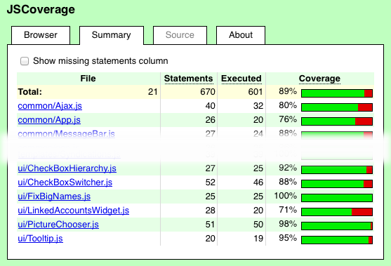
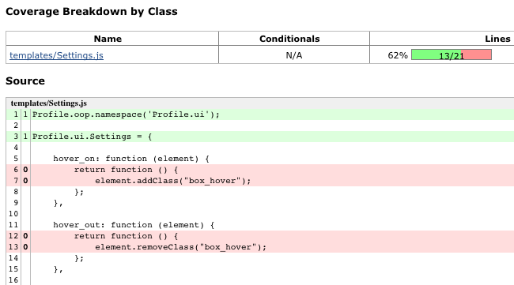
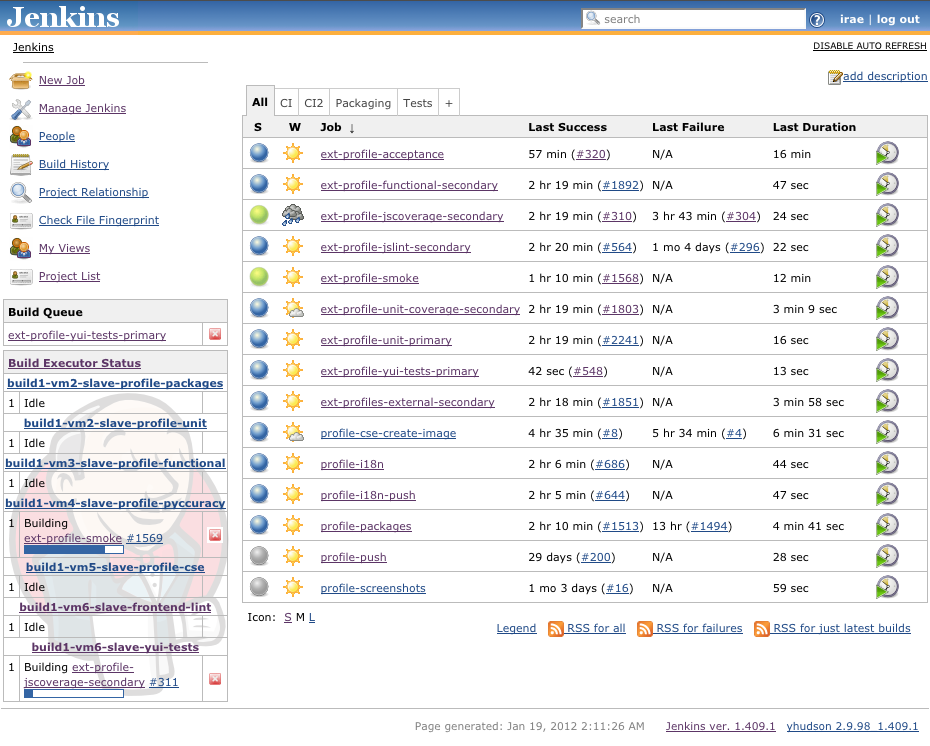

# Automatizando testes de <nobr>Javascript no Front-end</nobr>

-------------------------------------

## Iraê Carvalho

* [@irae](http://twitter.com/irae)
* [tech.irae.pro](http://tech.irae.pro/) (blog)
* [linkedin.com/in/iraee](http://www.linkedin.com/in/iraee)
* [github.com/irae](https://github.com/irae)

-------------------------------------

# O que veremos

* Objetivos de testar seu código
* Tipos de testes
* Ferramentas de testes
* Scritps e automação
* Integração Contínua

### Presenter Notes
* todas as etapas tem exemplos

-------------------------------------

# Por que testar seu código?

### Presenter Notes

* corrigir bugs é chato
* corrigir de novo é mais chato
* segurança ao subir o código
* documentação

-------------------------------------

# Tipos de testes

* Whitebox
    * Static code analysis
    * Unit
    * Coverage, Branch, Path, Conditional
* Blackbox
    * Integration
    * Acceptance
* Graybox
    * Black + Docs

-------------------------------------

# Exemplo

-------------------------------------

# Ferramentas

## Validadores

* JsLint
* JsHint

#
    npm install jslint jshint

### Presenter Notes

* validadores são um tipo de static code analisys

-------------------------------------

# Ferramentas

## Testes unitários e/ou funcionais

* qUnit
* YUI Test
* Jasmine
* Mocha
* Buster.js

# Presenter Notes

* assinaturas / contratos
* testes diretos e indiretos

-------------------------------------

# Exemplos

-------------------------------------

# Cobertura de código

# Presenter Notes

* Análise dos testes unitários
* Detecta quais linhas foram ou não executadas
* Aponta a falta de testes

-------------------------------------

# Cobertura de código

# Presenter Notes

* Análise dos testes unitários
* Detecta quais linhas foram ou não executadas
* Aponta a falta de testes

-------------------------------------

# Exemplo de Cobertura

### Presenter Notes

* Profile app/static/js/templates/SourcesLoader.js

-------------------------------------

# Alguns scripts

-------------------------------------

# Jenkins

-------------------------------------

# Obrigado

* [@irae](http://twitter.com/irae)
* [tech.irae.pro](http://tech.irae.pro/) (blog)
* [linkedin.com/in/iraee](http://www.linkedin.com/in/iraee)
* [github.com/irae](https://github.com/irae)
* https://github.com/irae/frontend-tests-pt

-------------------------------------

# Referências (1/3)

### Reading
* http://en.wikipedia.org/wiki/Software_testing
* http://net.tutsplus.com/tutorials/javascript-ajax/how-to-test-your-javascript-code-with-qunit/
* https://github.com/heynemann/pyccuracy/wiki/
* https://github.com/guilhermechapiewski/pyccuracy-presentation

-------------------------------------

# Referências (2/3)

### Tools
* http://www.jshint.com/
* http://visionmedia.github.com/mocha/
* http://yuilibrary.com/projects/yuitest/
* http://jenkins-ci.org/
* http://busterjs.org/
* https://github.com/douglascrockford/JSLint
* https://github.com/jquery/qunit
* https://github.com/yui/yuitest

-------------------------------------

# Referências (3/3)

### Repositories / Projects
* https://github.com/twada/qunit-tap
* https://github.com/bitzesty/qunit-mock
* https://github.com/joshuaclayton/qunit-examples
